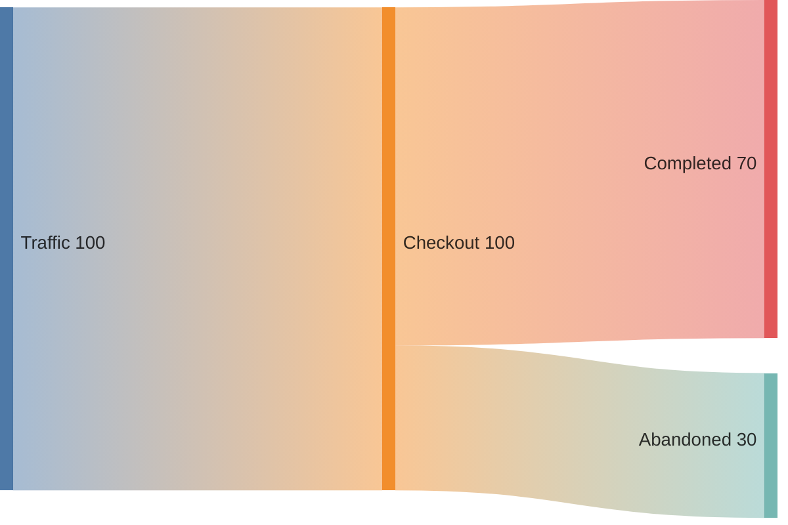
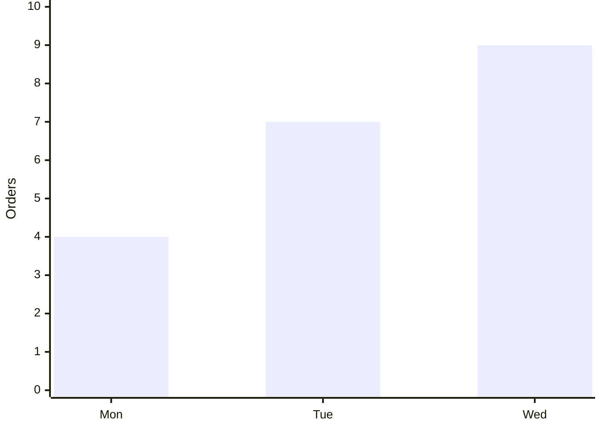
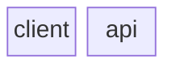
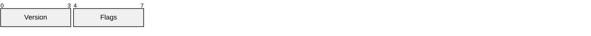
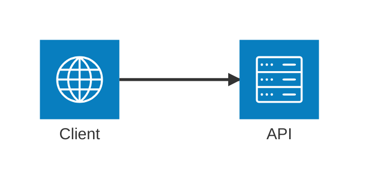
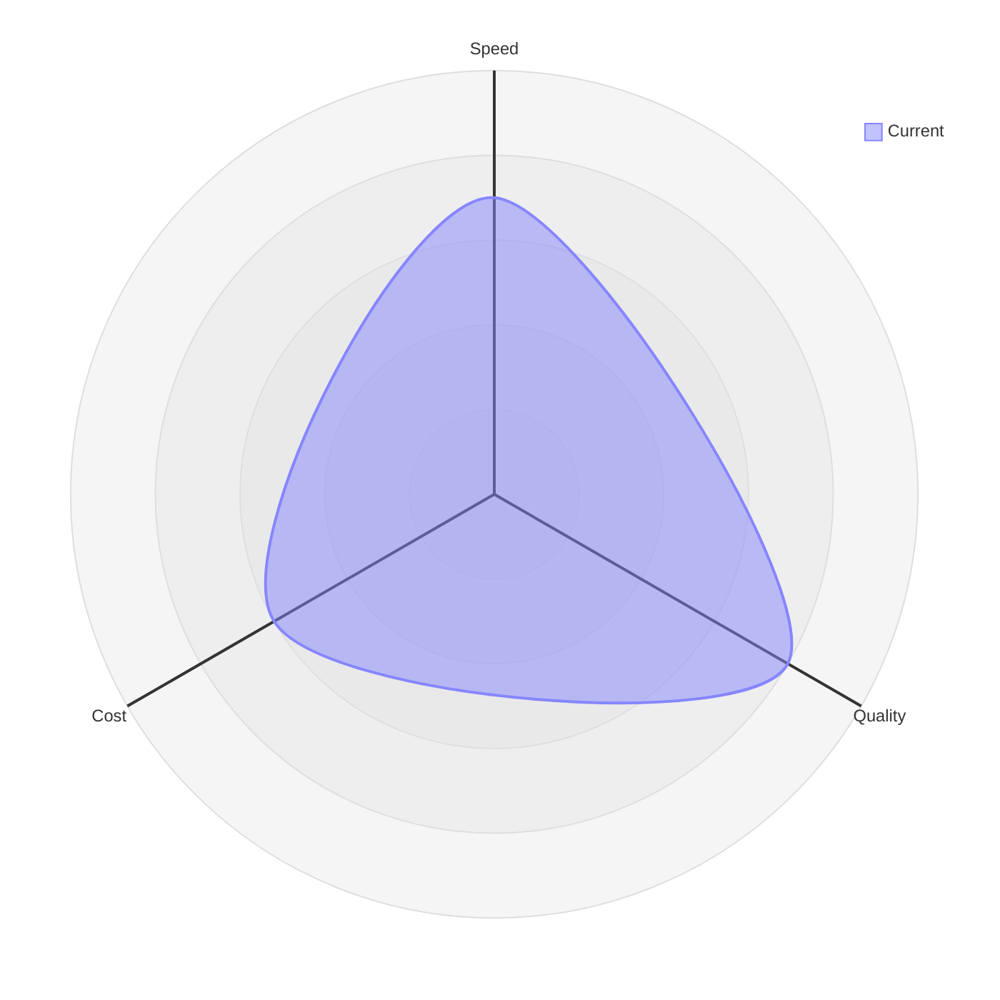
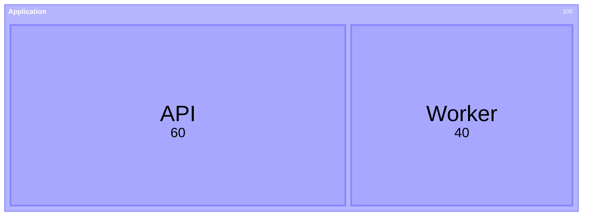
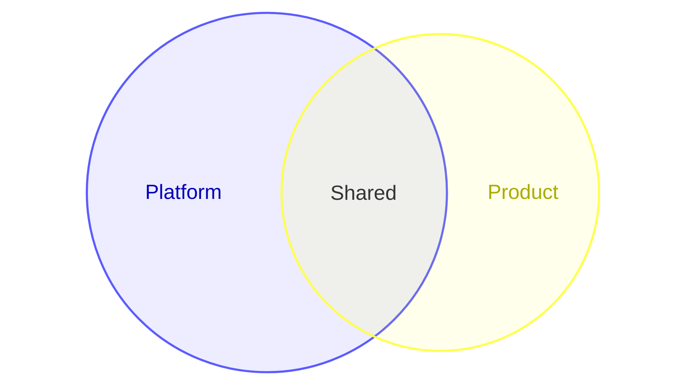
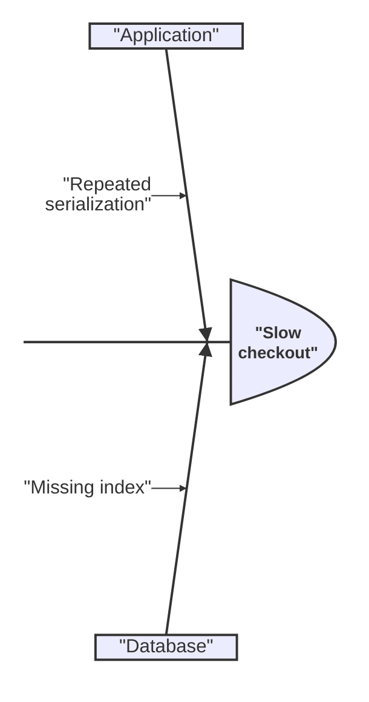

# Mermaid beta renderer coverage

```mermaid
swimlane-beta LR
  subgraph Customer
    request[Request]
  end
  subgraph Support
    triage[Triage]
  end
  request --> triage
```



















```mermaid
wardley-beta
  component Customer [0.95, 0.85]
  component Checkout [0.70, 0.60]
  Customer -> Checkout
```

```mermaid
cynefin-beta
  complex
    "Investigate incident"
  complicated
    "Analyze metrics"
  clear
    "Restart service"
  chaotic
    "Page on-call"
  confusion
    "Unknown failure"
```


